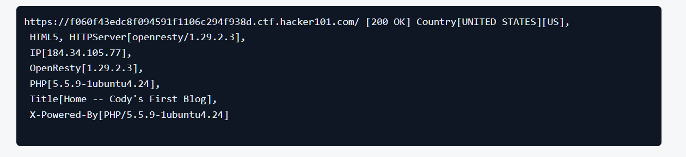
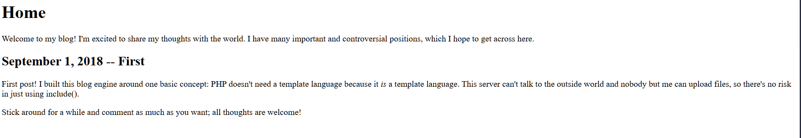
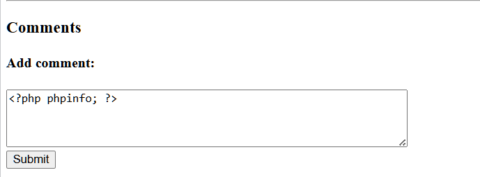
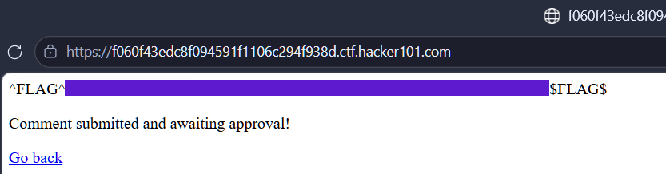
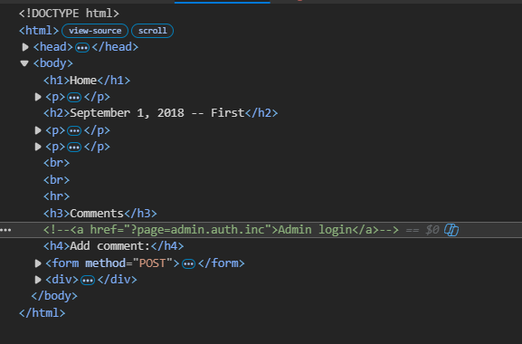
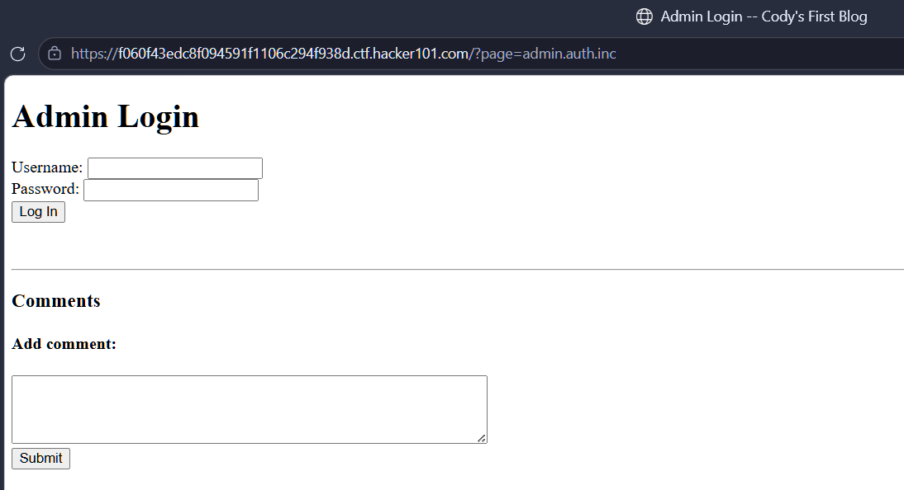
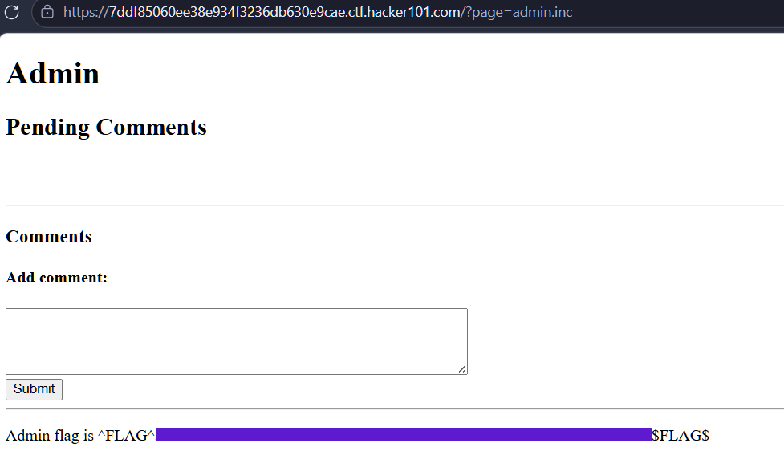
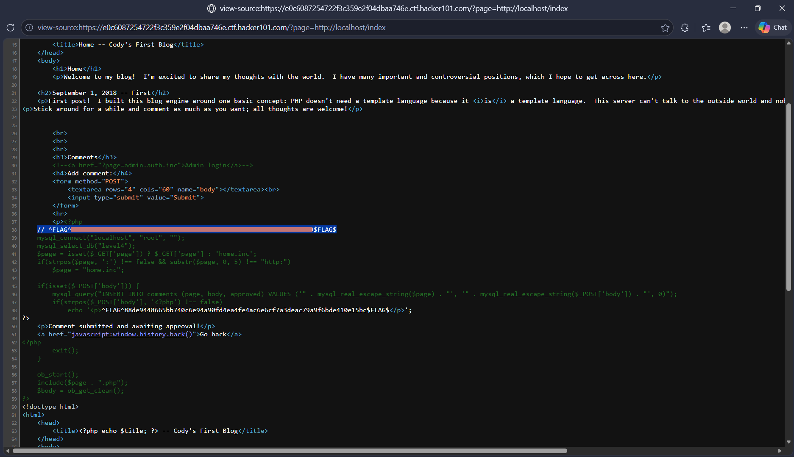

## Flag 0
### Methodology
1. At the first thing i do it utilize the tool **Whatweb** to get informations about what website i'm testing. Shown below is output from Whatweb, and the next one is what Cody tell us



2. Let's do some research on PHP vulnerabilites, yeah, I had very little prior experience with websites running on PHP. But, after doing research, i found a lot of information on vulns and CVEs from this past version. And i learned that it's possible to display a vulnerable site's PHP configuration through the use of the phpinfo function:
```php
<?php phpinfo; ?>
```
3. Let's try with this site:
 
 Binggo! We found the first flag:
 

## Flag 1
### Methodology
1. One of the first habit i built for website pentesting is reading raw source code. Doing so here reveals a classic infromation leak: an admin login page left commented out by the developer. Let's pivot to this hidden route and explour our next move.


2. I'm brought to login page. After trying brute force with the most common username and password, i became in stuck. But, wait, look at the url?page, i can try Blind SQL injection by adding an aspostrophe as value of the 'page' parameter. Yeah, as expected, it still returned error page.
3. let's think simply, look at the url, how the web display if we remove 'auth' in 'admin.auth.inc':
 
 And... bingo! We found the second flag:
 
 
## Flag 2
### Methodology
1. Firstly, i went back to comment section and try to read index.php with these payloads
```php
<?php echo readfile("index.php")?>
<?php echo file_get_contents("index.php")?> 
```
2. After submitting comments, those are appered in admin panel, but still invisible in client side. in this period, our payloads still exists as a string and actually they were not triggered. So, i need to find a way to trigger these payloads.
3. Let's do a research, i learned that we can simply trigger a vulnerable PHP website by using admin panel to approve our comments, then sending request to URL with */?page=http://localhost/index* parameter, view the source of this page, we got the third flag
 

### Let's dive deep into how it work
    - The exploit leverages a server misconfiguration where *allow_url_include* is enabled alongside an unvalidated include() function. That is the precondition.
    - By submitting the payload /?page=http://localhost/index, we can trigger a self-referential Remote File Inclusion (RFI), forcing the server to make an internal HTTP request to its own index page. The response returned via the HTTP wrapper contains the fully rendered HTML, which includes previously injected malicious PHP payload stored in the user comments. This HTTP inclusion creates a fresh execution context, compelling the PHP engine to parse and execute the embedded scripts. Consequently, This technique bypass local file restrictions, achiecing RCE while forcing the server to disclose its raw PHP source code and the hidden flag.